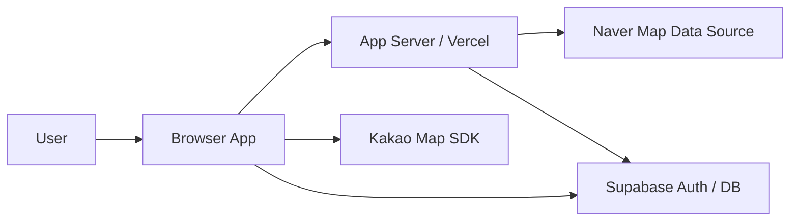

# System Context

## Purpose
Nurimap은 사내 구성원만 접근할 수 있는 웹 애플리케이션이다. 
사용자는 네이버 지도 URL을 입력해 place를 등록하고, Kakao Map 기반 지도/목록/상세 화면에서 place를 탐색한다.

## Actors
- User
  - `@nurimedia.co.kr` 이메일을 가진 사내 구성원
- Browser App
  - React 웹 애플리케이션
- Server Runtime
  - Vercel에서 실행되는 서버 측 로직
- Supabase
  - Auth, Database
- Kakao Map
  - 지도 렌더링
- Naver Map
  - URL 입력 출처 및 place 데이터 조회 대상

## System Boundary

## Responsibility Split
| Component | Responsibility |
|---|---|
| Browser App | 로그인 UI, 로그인 전용 URL 진입 처리, URL 입력, 지도/목록/상세 렌더링, 세션 복원, 사용자 상호작용 |
| App Server | Naver Map URL 정규화 보조, place 조회 프록시, 좌표 fallback geocoding, 민감한 API 호출, 서버 검증 |
| Supabase Auth | 이메일 로그인 링크 인증, 세션 발급 및 갱신 |
| Supabase DB | place, review, recommendation, user 관련 데이터 저장 |
| Kakao Map SDK | 지도 렌더링, 마커 표시, 줌/팬 이벤트 |
| Kakao Local / Geocoder | 주소를 좌표로 변환하는 geocoding fallback |
| Naver Map Data Source | place 이름/주소/좌표 조회 후보 소스 |

## Trust Boundaries
- 브라우저는 비신뢰 영역이다.
- 서비스 역할 키와 원격 조회 민감 로직은 서버에서만 사용한다.
- 사용자가 입력한 URL과 이메일은 항상 서버에서 다시 검증한다.

## Primary User Entry Points
- 로그인 화면
- 로그인 전용 URL
- place 등록 흐름
- 지도 탐색 화면
- 목록 탐색 화면
- place 상세 화면

## Global Constraints
- 전체 화면과 API는 로그인 뒤에만 접근 가능하다.
- 검색 엔진 노출을 막아야 한다.
- place의 canonical 외부 식별자는 `naver_place_id`다.
