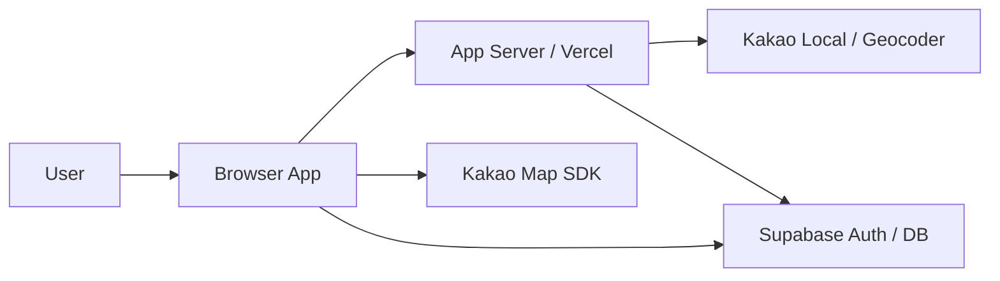

# System Runtime

이 문서는 Nurimap의 runtime boundary, route/state ownership, client/server responsibility, integration pipeline의 source of truth다.
도메인 엔터티와 데이터 무결성은 [Domain Model](./domain-model.md), 인증/세션/운영 정책은 [Security And Ops](./security-and-ops.md)에서 관리한다.

## Runtime Scope
- 브라우저 앱, 서버 런타임, Supabase, Kakao Map, geocoding 경계의 책임을 정의한다.
- durable/shareable state와 view-local state의 소유권을 구분한다.
- place write, auth verify, map browse 같은 핵심 runtime pipeline을 정의한다.

## Actors
- User
  - `@nurimedia.co.kr` 이메일을 가진 사내 구성원
- Browser App
  - React 웹 애플리케이션
- Server Runtime
  - Vercel에서 실행되는 서버 측 로직
- Supabase
  - Auth, Database
- Kakao Map SDK
  - 지도 렌더링
- Kakao Local / Geocoder
  - 주소 geocoding

## System Boundary

## Canonical Entry Contract
| Surface | Canonical path / state | Notes |
|---|---|---|
| Auth request surface | `/` + auth phase | 로그인 전 진입점이다. |
| Auth verify surface | `/auth/verify?...` | 로그인 링크 검증을 처리하는 auth verify entry다. exact query contract는 selected spec을 따른다. |
| Browse surface | `/` | 지도 + 목록 기본 surface다. |
| Place detail surface | `/places/:placeId` | durable/shareable detail source of truth다. desktop은 sidebar detail, mobile은 full-screen detail을 유지한다. |
| Place add surface | internal `place_add_open` state | 별도 `/add-place` route를 만들지 않는다. 등록 성공 후에는 결과 place의 `/places/:placeId`로 이동한다. |
| Mobile place list surface | internal `mobile_place_list_open` state | 모바일 전용 목록 surface다. |

## Route And State Ownership
- durable/shareable state는 route가 관리한다.
  - `/`
  - `/places/:placeId`
  - `/auth/verify`
- transient/view-local state는 local store가 관리한다.
  - `selectedPlaceId`
  - `mapLevel`
  - `placeListLoad`
  - `placeDetailLoad`
  - `place_add_open`
  - `mobile_place_list_open`
  - draft form state
- route/store bridge는 UI layer에서 수행한다. store action 안에서 `navigate()`를 직접 호출하지 않는다.
- route param `placeId`가 있으면 `place_detail_open` surface가 active이며, route가 detail open 여부의 source of truth다.
- `selectedPlaceId`는 route param이 없을 때도 마지막 focus/selection anchor로 유지될 수 있다.

## Auth Phase Contract
인증 phase는 app-shell navigation state와 별도로 관리한다.

| Phase | Meaning | Notes |
|---|---|---|
| `loading` | bootstrap 중 | transient phase다. 장시간 유지되면 안 된다. |
| `auth_required` | 로그인 전 상태 | 로그인 요청 surface를 표시한다. |
| `auth_link_sent` | 로그인 링크 발송 후 대기 상태 | 같은 auth surface 안에서 재전송을 수행한다. |
| `verifying` | 로그인 링크 검증 중 | transient phase다. refresh나 예외 상황에서도 terminal state로 수렴해야 한다. |
| `auth_failure` | 인증 실패 화면 | 검증 실패를 처리하는 terminal auth phase다. |
| `name_required` | 이름 입력이 필요한 상태 | 이름 입력 완료 후 authenticated app으로 진입한다. |
| `authenticated` | app shell 진입 가능 상태 | 이후 browse/detail/add surface는 app-shell navigation state가 관리한다. |

## App Shell Navigation Contract
| State | Meaning | Notes |
|---|---|---|
| `map_browse` | 지도 탐색 기본 상태 | browse 기본 surface다. |
| `mobile_place_list_open` | 모바일 목록 화면 | 모바일에서만 활성화된다. |
| `place_add_open` | 기존 목록 영역이 등록 화면으로 전환된 상태 | URL은 바뀌지 않는다. |
| `place_detail_open` | 장소 상세 화면 | canonical route(`/places/:placeId`)와 동기화된다. |

## Async Substate Contract
| Key | Values | Applies To | Description |
|---|---|---|---|
| `auth_request` | `idle`, `submitting`, `error` | 로그인 화면 | 로그인 링크 요청 상태 |
| `auth_link_verify` | `idle`, `verifying`, `error` | 로그인 링크 진입 | 로그인 링크 검증 상태 |
| `name_submit` | `idle`, `submitting`, `error` | 이름 입력 화면 | 이름 저장 상태 |
| `place_submit` | `idle`, `submitting`, `error` | 장소 등록 UI | 입력 검증, geocoding, 저장 상태 |
| `place_list_load` | `idle`, `loading`, `empty`, `ready`, `error` | 목록 화면 | 장소 목록 로딩 상태 |
| `place_detail_load` | `idle`, `loading`, `ready`, `error` | 상세 화면 | 장소 상세 로딩 상태 |
| `review_submit` | `idle`, `submitting`, `error` | 리뷰 작성 UI | 리뷰와 별점 저장 상태 |
| `recommendation_toggle` | `idle`, `submitting`, `error` | 추천 버튼 | 추천 추가/취소 요청 상태 |

상태 모델 원칙:
- auth phase, navigation state, async substate는 서로 다른 층으로 분리한다.
- 같은 층 안에서는 한 시점에 하나의 canonical state만 활성화한다.
- `loading`, `verifying`, `submitting` 상태에서는 같은 액션을 중복 실행하지 않는다.
- `error`가 발생해도 전용 실패 화면이 정의된 경우를 제외하면 현재 화면, 입력값, 선택 상태를 유지한다.
- `success`는 장기 유지 상태로 두지 않고 데이터 갱신 또는 다음 canonical state 전환으로 흡수한다.

## Global Runtime Constants
- responsive breakpoint: `768px`
- 지도 시작 주소: `서울 마포구 양화로19길 22-16`
- 지도 시작 좌표: `37.558721, 126.924440`

## Responsibility Split
| Component | Responsibility |
|---|---|
| Browser App | auth surface 렌더링, route/store bridge, 이름/주소 입력, 지도/목록/상세 렌더링, 세션 복원, 사용자 상호작용 |
| App Server | 입력 검증, geocoding 프록시, 중복 판정 보조, 민감한 API 호출, 서버 검증 |
| Supabase Auth | 이메일 로그인 링크 인증, 세션 발급 및 갱신 |
| Supabase DB | place, review, recommendation, user 관련 데이터 저장 |
| Kakao Map SDK | 지도 렌더링, 마커 표시, 줌/팬 이벤트 |
| Kakao Local / Geocoder | 주소를 좌표로 변환하는 geocoding |

## Trust Boundaries
- 브라우저는 비신뢰 영역이다.
- service role key와 geocoding 같은 민감 로직은 서버에서만 사용한다.
- 사용자가 입력한 이름, 주소, 이메일은 항상 서버에서 다시 검증한다.
- 앱 UI는 저장 완료 전에 place를 canonical 데이터로 취급하지 않는다.

## Place Write Pipeline

### Required Inputs
- `name`
- `road_address`
- `place_type`
- `zeropay_status`
- `rating_score`

### Optional Inputs
- `land_lot_address`
- `review_content`

### Validation Rules
- 이름과 도로명 주소는 필수다.
- 장소 구분, 제로페이 상태, 평가는 저장 전에 반드시 유효한 enum/score 값이어야 한다.
- 선택 입력값은 비어 있어도 등록 흐름을 막지 않는다.
- 검증 실패 시 inline error를 표시하고 현재 surface에 머문다.

### Write Sequence
1. 클라이언트가 `name`, `road_address`, `place_type`, `zeropay_status`, `rating_score`와 선택 입력을 제출한다.
2. 서버가 필수 입력과 enum 값을 검증한다.
3. 서버가 좌표 확보를 아래 우선순위로 시도한다.
   - 1순위: `road_address` geocoding
   - 2순위: `land_lot_address` geocoding
4. 최종 좌표를 확보한 경우에만 place 저장을 진행한다.
5. 저장 성공 후 browse 데이터와 선택 상태를 갱신하고 결과 place의 `/places/:placeId` route로 이동한다.
6. geocoding이나 저장이 실패하면 현재 surface와 사용자가 입력한 값을 유지한 채 실패 상태를 반환한다.

### Failure Cases
- 이름이 비어 있음
- 도로명 주소가 비어 있음
- enum 또는 score 값이 유효하지 않음
- geocoding이 최종 실패함
- 저장 API가 실패함

## Map Runtime Contract

### Inputs
- Kakao Map app key
- 중심 좌표: `37.558721, 126.924440`
- place 목록

### Rendering Rules
- 지도에는 `latitude`, `longitude`를 가진 place만 표시한다.
- `place_type`에 따라 다른 marker presentation을 사용한다.
- Kakao 공식 zoom control을 노출하고, 앱 상태는 `zoom_changed` 이벤트와 `getLevel()` 기준으로 동기화한다.
- 지도 이동/확대축소 이벤트는 과도한 API 재호출을 만들지 않도록 debounce 또는 throttle을 적용한다.
- 지도 라벨은 기본적으로 `level 1-5`에서 표시하고 `level 6`부터 숨긴다.

### Runtime Feedback Rules
- Kakao SDK loading 동안에는 사용자가 실제 지도로 오해하지 않는 명시적 loading state를 표시한다.
- Kakao SDK load failure 또는 runtime unavailable 상태에서는 현재 맥락을 유지한 채 다시 시도 가능한 failure state를 표시한다.
- test/JSDOM용 deterministic fallback renderer가 있어도 runtime user-facing loading/error UI와 역할을 섞지 않는다.

## Auth And Session Runtime Touchpoints
- 로그인 요청은 `auth_required` surface에서 시작한다.
- 로그인 링크 검증은 auth verify entry를 사용한다. exact entry contract는 selected spec이 정한다.
- auth bootstrap은 refresh, hard refresh, logout 후 재로그인에서도 `auth_required`, `auth_failure`, `name_required`, `authenticated` 중 하나의 terminal state로 수렴해야 한다.
- `verifying`는 transient phase이며, verify-link failure나 malformed payload가 무한 대기로 남아서는 안 된다.
- 로그인 성공 시 저장된 세션을 같은 브라우저 프로필에서 복원하고, 앱 시작 시 `getUser()` 또는 보호된 API 확인으로 유효성을 재검증한다.
- 세션 절대 만료와 token refresh 정책의 상세 보안 규칙은 [Security And Ops](./security-and-ops.md)를 따른다.
